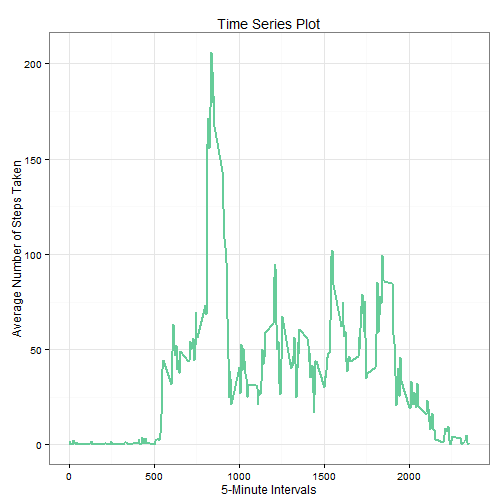

#Reproducible Research: Peer Assessment 1

**Author:** Javier Samir Rey
**Date  :** Saturday, June 13, 2015

### Settings

```r
echo = TRUE  # Always make code visible
```

### Loading and preprocessing the data

```r
data <- read.csv("activity.csv", colClasses = c("integer", "Date", "integer"))
data$month <- as.numeric(format(data$date, "%m"))
dataNaOmit <- na.omit(data)

str(dataNaOmit)
```

```
## 'data.frame':	15264 obs. of  4 variables:
##  $ steps   : int  0 0 0 0 0 0 0 0 0 0 ...
##  $ date    : Date, format: "2012-10-02" "2012-10-02" ...
##  $ interval: int  0 5 10 15 20 25 30 35 40 45 ...
##  $ month   : num  10 10 10 10 10 10 10 10 10 10 ...
##  - attr(*, "na.action")=Class 'omit'  Named int [1:2304] 1 2 3 4 5 6 7 8 9 10 ...
##   .. ..- attr(*, "names")= chr [1:2304] "1" "2" "3" "4" ...
```

```r
dim(dataNaOmit)
```

```
## [1] 15264     4
```

```r
head(dataNaOmit)
```

```
##     steps       date interval month
## 289     0 2012-10-02        0    10
## 290     0 2012-10-02        5    10
## 291     0 2012-10-02       10    10
## 292     0 2012-10-02       15    10
## 293     0 2012-10-02       20    10
## 294     0 2012-10-02       25    10
```

### What is mean total number of steps taken per day?
*For this part of the assignment, you can ignore the missing values in the dataset.*

* Make a histogram of the total number of steps taken each day

```r
library(ggplot2)
graph <- ggplot(dataNaOmit, aes(date, steps)) + geom_bar(stat = "identity", colour = "Brown", fill = "orange", width = 0.7) + facet_grid(. ~ month, scales = "free") + labs(title = "Histogram of Total Number of Steps Taken Each Day", x = "Dates", y = "Total number of steps")
theme_set(theme_bw()) # override the theme 
graph
```

 

* Calculate and report the mean and median total number of steps taken per day

*Mean total number of steps taken per day:*

```r
library(dplyr)
steps.day <- dataNaOmit %>% group_by(date) %>% summarise(steps = sum(steps))
mean(steps.day$steps)
```

```
## [1] 10766.19
```
*Median total number of steps taken per day:*

```r
median(steps.day$steps)
```

```
## [1] 10765
```

###What is the average daily activity pattern?

* Make a time series plot (i.e. type = "l") of the 5-minute interval (x-axis) and the average number of steps taken, averaged across all days (y-axis)

```r
steps.interval <- dataNaOmit %>% group_by(interval = as.numeric(as.character(interval))) %>% summarise(meanSteps = mean(steps))

graph <- ggplot(steps.interval, aes(interval, meanSteps)) + geom_line(colour = "#66CC99", size = 1) + labs(title = "Time Series Plot", x = "5-Minute Intervals", y = "Average Number of Steps Taken")
graph
```

 

* Which 5-minute interval, on average across all the days in the dataset, contains the maximum number of steps?


```r
steps.interval[steps.interval$meanSteps == max(steps.interval$meanSteps), ]
```

```
## Source: local data frame [1 x 2]
## 
##   interval meanSteps
## 1      835  206.1698
```

###Imputing missing values

*Note that there are a number of days/intervals where there are missing values (coded as NA). The presence of missing days may introduce bias into some calculations or summaries of the data.*

* Calculate and report the total number of missing values in the dataset (i.e. the total number of rows with NAs)


```r
sum(is.na(data))
```

```
## [1] 2304
```

* Devise a strategy for filling in all of the missing values in the dataset. The strategy does not need to be sophisticated. For example, you could use the mean/median for that day, or the mean for that 5-minute interval, etc.

*My strategy is to use mean, calculated in before steps*

* Create a new dataset that is equal to the original dataset but with the missing data filled in.

```r
filledData <- data 

for (i in 1:nrow(filledData)) {
    if (is.na(filledData$steps[i])) {
        filledData$steps[i] <- as.numeric(steps.interval[steps.interval$interval == filledData$interval[i], "meanSteps"])
        }
    }
head(filledData)
```

```
##       steps       date interval month
## 1 1.7169811 2012-10-01        0    10
## 2 0.3396226 2012-10-01        5    10
## 3 0.1320755 2012-10-01       10    10
## 4 0.1509434 2012-10-01       15    10
## 5 0.0754717 2012-10-01       20    10
## 6 2.0943396 2012-10-01       25    10
```

```r
sum(is.na(filledData))
```

```
## [1] 0
```

* Make a histogram of the total number of steps taken each day and Calculate and report the mean and median total number of steps taken per day


```r
graph <- ggplot(filledData, aes(date, steps)) + geom_bar(stat = "identity", colour = "blue", fill = "green", width = 0.7) + facet_grid(. ~ month, scales = "free") + labs(title = "Histogram of Total Number of Steps Taken Each Day", x = "Dates", y = "Total number of steps")
theme_set(theme_bw()) # override the theme 
graph
```

 

* Do these values differ from the estimates from the first part of the assignment? What is the impact of imputing missing data on the estimates of the total daily number of steps?


```r
stepsDayFilled <- filledData %>% group_by(date) %>% summarise(steps = sum(steps))

# mean
mean(stepsDayFilled$steps)
```

```
## [1] 10766.19
```

```r
meanFilledData = mean(stepsDayFilled$steps)
# median
median(stepsDayFilled$steps)
```

```
## [1] 10766.19
```

```r
medianFilledData = median(stepsDayFilled$steps)

antMean <- mean(steps.day$steps)
antMedian <- median(steps.day$steps)
meanFilledData - antMean
```

```
## [1] 0
```

```r
medianFilledData - antMedian
```

```
## [1] 1.188679
```

* the new mean of total steps taken per day is the same as that of the firts mean; the new median of total steps taken per day is greater than that of the firts median.

###Are there differences in activity patterns between weekdays and weekends?

*For this part the weekdays() function may be of some help here. Use the dataset with the filled-in missing values for this part.*

* Create a new factor variable in the dataset with two levels -- "weekday" and "weekend" indicating whether a given date is a weekday or weekend day.


```r
filledData$typedays <- format(filledData$date, "%u")
filledData$typedays[filledData$typedays %in% c(1,2,3,4,5)] <- "weekday"
filledData$typedays[filledData$typedays %in% c(6, 7)] <- "weekend"
filledData$typedays <- as.factor(filledData$typedays)
```

* Make a panel plot containing a time series plot (i.e. type = "l") of the 5-minute interval (x-axis) and the average number of steps taken, averaged across all weekday days or weekend days (y-axis).


```r
library(lattice)
meanStepsweek <- filledData %>% group_by(interval, typedays) %>% summarise(meansteps = mean(steps))  

xyplot(meanStepsweek$meansteps ~ meanStepsweek$interval | meanStepsweek$typedays, 
       layout = c(1, 2), type = "l", 
       xlab = "Interval", ylab = "Number of steps")
```

 
